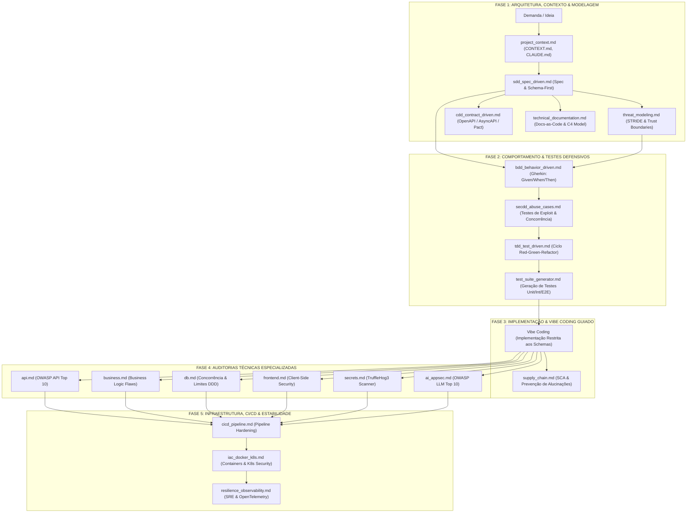

# 🛡️ Suíte de Prompts de Engenharia de Software, AppSec & Yellow Team

<div align="center">

[](LICENSE)
[](https://github.com/brunoez/prompts)
[](.gitlab-ci.yml)
[](CONTRIBUTING.md)
[](README.md)

**A biblioteca definitiva de prompts estruturados de auditoria profunda, arquitetura defensiva e metodologias *Driven Development* para desenvolvedores, arquitetos e agentes de Inteligência Artificial.**

[Instalação Rápida](#-instalação-rápida) • [O Ciclo Yellow Team](#-o-ciclo-de-desenvolvimento-seguro-yellow-team-pipeline) • [Qual Prompt Usar?](#-qual-prompt-usar-guia-de-ação-rápida-com-exemplos) • [Catálogo Completo](#-catálogo-completo-de-prompts) • [Contribuição](CONTRIBUTING.md)

</div>

---

## 🇧🇷 Sobre o Projeto

Criado com foco na comunidade brasileira de desenvolvimento e AppSec, este repositório aberto reúne **prompts técnicos de alto nível** projetados para serem executados por Engenheiros Principais ou Agentes de IA (Antigravity, Cursor, Windsurf, Claude Code, GitHub Copilot).

O objetivo é transformar a velocidade do **Vibe Coding** em software de **nível corporativo**: seguro contra vulnerabilidades (OWASP), arquiteturalmente consistente (DDD/SDD), resiliente em produção (SRE) e 100% testado (TDD, BDD, SecDD).

---

## ⚡ Instalação Rápida

Você pode instalar a suíte de prompts em qualquer projeto com um único comando:

Execute na raiz do seu projeto:

```bash
curl -sSL https://raw.githubusercontent.com/brunoez/prompts/main/install.sh | bash
```

> **Dica:** Por padrão, os prompts são instalados em `.agent/prompts/`. Se você usa **Cursor**, **Windsurf** ou deseja instalar para todas as ferramentas:
> ```bash
> # Para Cursor (.cursor/rules):
> curl -sSL https://raw.githubusercontent.com/brunoez/prompts/main/install.sh | bash -s -- . cursor
> 
> # Para Windsurf (.windsurf/rules):
> curl -sSL https://raw.githubusercontent.com/brunoez/prompts/main/install.sh | bash -s -- . windsurf
> 
> # Para todas as ferramentas simultaneamente:
> curl -sSL https://raw.githubusercontent.com/brunoez/prompts/main/install.sh | bash -s -- . all
> ```

---

### 📁 Estrutura de Diretórios Gerada no Projeto Após a Instalação

Após executar o comando acima, o seu repositório passará a conter a seguinte organização modular:

```plaintext
seu-projeto/
├── .agent/prompts/                          # (ou .cursor/rules/ ou .windsurf/rules/)
│   ├── driven-development/                  # Metodologias & Guardrails Arquiteturais
│   │   ├── bdd_behavior_driven.md           # BDD, Gherkin & Critérios de Aceite Executáveis
│   │   ├── cdd_contract_driven.md           # Contratos OpenAPI, AsyncAPI & Consumer Pact
│   │   ├── project_context.md               # Contexto, Dicionário do Projeto & Regras de IA
│   │   ├── sdd_spec_driven.md               # Software Design Doc (SDD) & Schemas Zod Estritos
│   │   ├── secdd_abuse_cases.md             # Testes de Exploit, BOLA & Casos de Abuso
│   │   ├── tdd_test_driven.md               # Ciclo Red-Green-Refactor & Testes Unitários
│   │   ├── test_suite_generator.md          # Geração Completa da Pirâmide de Testes (Unit/Int/E2E)
│   │   └── technical_documentation.md       # Documentação Técnica Completa (Docs-as-Code & C4)
│   ├── security/                            # AppSec & Auditorias Especializadas
│   │   ├── ai_appsec.md                     # OWASP Top 10 for LLMs / GenAI Security
│   │   ├── api.md                           # OWASP API Security Top 10 & Rate Limiting
│   │   ├── business.md                      # Falhas de Lógica de Negócio, Fraudes & TOCTOU
│   │   ├── db.md                            # Concorrência de Banco, Locks & Limites DDD
│   │   ├── frontend.md                      # Client-Side Security, XSS, CSRF & SPAs
│   │   ├── secrets.md                       # Scanner TruffleHog3 & Gestão de Segredos
│   │   ├── supply_chain.md                  # Supply Chain, SCA & Anti-Slopsquatting
│   │   └── threat_modeling.md               # Modelagem de Ameaças & Framework STRIDE
│   └── devops/                              # Infraestrutura, CI/CD & Confiabilidade
│       ├── cicd_pipeline.md                 # Hardening de Pipelines (GitHub Actions / GitLab CI)
│       ├── iac_docker_k8s.md                # IaC (Terraform), Docker Rootless & K8s Security
│       └── resilience_observability.md      # SRE, OpenTelemetry, Filas DLQ & Resiliência
├── src/                                     # Código-fonte da sua aplicação
├── tests/                                   # Suíte de testes automatizados
├── docs/                                    # Onde os relatórios PDF e auditorias serão gerados
├── CONTEXT.md                               # Dicionário e vocabulário do negócio para IAs
├── CLAUDE.md / .cursorrules                 # Diretrizes específicas para cada ferramenta de IA
└── package.json / pyproject.toml / go.mod   # Dependências e manifestos do seu projeto
```

---

## 🧭 O Ciclo de Desenvolvimento Seguro (Yellow Team Pipeline)



---

## 💡 Qual Prompt Usar? (Guia de Ação Rápida com Exemplos)

Encontre abaixo exatamente o que você deseja fazer e o prompt correspondente pronto para executar no chat da sua IDE ou Agente:

### 🛡️ 1. Segurança & AppSec
* **Para saber a segurança da API da aplicação (OWASP API Top 10):**
  * **Use:** [`prompts/security/api.md`](prompts/security/api.md)
  * **Comando:**
    ```markdown
    @[.agent/prompts/security/api.md] Execute a auditoria de APIs neste repositório e gere o relatório em PDF.
    ```

* **Para encontrar fraudes, falhas em regras de negócio e pulo de etapas (checkout/MFA):**
  * **Use:** [`prompts/security/business.md`](prompts/security/business.md)
  * **Comando:**
    ```markdown
    @[.agent/prompts/security/business.md] Audite as regras de negócio de pedidos e pagamentos contra fraudes e race conditions (TOCTOU).
    ```

* **Para checar vazamento de senhas, chaves de API e segredos expostos no Git ou `.env`:**
  * **Use:** [`prompts/security/secrets.md`](prompts/security/secrets.md)
  * **Comando:**
    ```markdown
    @[.agent/prompts/security/secrets.md] Configure o venv, rode o TruffleHog3 e filtre os segredos e falsos positivos do projeto.
    ```

* **Para auditar a segurança do frontend, SPAs e proteção contra XSS/CSRF:**
  * **Use:** [`prompts/security/frontend.md`](prompts/security/frontend.md)
  * **Comando:**
    ```markdown
    @[.agent/prompts/security/frontend.md] Audite os componentes e rotas frontend contra XSS, vazamento de tokens e problemas de Core Web Vitals.
    ```

* **Para auditar a segurança do banco de dados, concorrência e injeções SQL:**
  * **Use:** [`prompts/security/db.md`](prompts/security/db.md)
  * **Comando:**
    ```markdown
    @[.agent/prompts/security/db.md] Audite as queries e migrações do banco contra SQL Injection, N+1 queries e deadlocks de concorrência.
    ```

* **Para identificar alucinações de pacotes por IA (*Slopsquatting*), CVEs e dependências maliciosas:**
  * **Use:** [`prompts/security/supply_chain.md`](prompts/security/supply_chain.md)
  * **Comando:**
    ```markdown
    @[.agent/prompts/security/supply_chain.md] Audite o package.json e lockfiles contra pacotes alucinados e vulnerabilidades conhecidas (SCA).
    ```

* **Para mapear ameaças (STRIDE) e fronteiras de confiança antes de codificar:**
  * **Use:** [`prompts/security/threat_modeling.md`](prompts/security/threat_modeling.md)
  * **Comando:**
    ```markdown
    @[.agent/prompts/security/threat_modeling.md] Faça a modelagem de ameaças STRIDE para a arquitetura desta aplicação e gere a matriz de contramedidas.
    ```

* **Para auditar aplicações que usam IA (LLMs, RAG e Agentes) contra injeção de prompt:**
  * **Use:** [`prompts/security/ai_appsec.md`](prompts/security/ai_appsec.md)
  * **Comando:**
    ```markdown
    @[.agent/prompts/security/ai_appsec.md] Audite as integrações de LLM e RAG contra Prompt Injection, Insecure Output e Excessive Agency.
    ```

---

### 🎯 2. Arquitetura, Contexto & Testes (Driven Developments)
* **Para ensinar o vocabulário do seu negócio à IA e gerar `CONTEXT.md`, `CLAUDE.md` e `.cursorrules`:**
  * **Use:** [`prompts/driven-development/project_context.md`](prompts/driven-development/project_context.md)
  * **Comando:**
    ```markdown
    @[.agent/prompts/driven-development/project_context.md] Crie o CONTEXT.md com o dicionário do projeto e os arquivos CLAUDE.md e .cursorrules.
    ```

* **Para gerar a documentação técnica completa da aplicação (Stack, C4 Model, DER do Banco e APIs):**
  * **Use:** [`prompts/driven-development/technical_documentation.md`](prompts/driven-development/technical_documentation.md)
  * **Comando:**
    ```markdown
    @[.agent/prompts/driven-development/technical_documentation.md] Mapeie o projeto e gere o docs/architecture/ARCHITECTURE.md com diagramas Mermaid C4 e DER.
    ```

* **Para gerar, escrever e rodar a suíte completa de testes automatizados (Unitários, Integração e E2E):**
  * **Use:** [`prompts/driven-development/test_suite_generator.md`](prompts/driven-development/test_suite_generator.md)
  * **Comando:**
    ```markdown
    @[.agent/prompts/driven-development/test_suite_generator.md] Crie os testes unitários e de integração que faltam neste projeto e rode até ficarem 100% verdes.
    ```

* **Para planejar uma nova funcionalidade com especificação técnica (SDD) e Schemas Zod antes de programar:**
  * **Use:** [`prompts/driven-development/sdd_spec_driven.md`](prompts/driven-development/sdd_spec_driven.md)
  * **Comando:**
    ```markdown
    @[.agent/prompts/driven-development/sdd_spec_driven.md] Crie o Software Design Document e os Schemas Zod para a nova funcionalidade de [Nome da Feature].
    ```

* **Para criar testes automáticos de invasão, BOLA/IDOR, Mass Assignment e concorrência:**
  * **Use:** [`prompts/driven-development/secdd_abuse_cases.md`](prompts/driven-development/secdd_abuse_cases.md)
  * **Comando:**
    ```markdown
    @[.agent/prompts/driven-development/secdd_abuse_cases.md] Escreva testes de abuso simulando usuários tentando acessar dados de outros tenants e estourar rate limit.
    ```

* **Para documentar o comportamento do sistema em Gherkin (`Given/When/Then`) e validar máquinas de estado:**
  * **Use:** [`prompts/driven-development/bdd_behavior_driven.md`](prompts/driven-development/bdd_behavior_driven.md)
  * **Comando:**
    ```markdown
    @[.agent/prompts/driven-development/bdd_behavior_driven.md] Modele os fluxos de checkout e cancelamento em arquivos .feature com sintaxe Gherkin.
    ```

* **Para aplicar o ciclo TDD (Red-Green-Refactor) e cobrir casos de borda em funções:**
  * **Use:** [`prompts/driven-development/tdd_test_driven.md`](prompts/driven-development/tdd_test_driven.md)
  * **Comando:**
    ```markdown
    @[.agent/prompts/driven-development/tdd_test_driven.md] Aplique TDD para criar os testes unitários da camada de serviços antes de implementar o código.
    ```

* **Para garantir contratos de API entre serviços e frontend sem quebras (*Breaking Changes*):**
  * **Use:** [`prompts/driven-development/cdd_contract_driven.md`](prompts/driven-development/cdd_contract_driven.md)
  * **Comando:**
    ```markdown
    @[.agent/prompts/driven-development/cdd_contract_driven.md] Valide a conformidade das rotas com a spec OpenAPI e configure testes de contrato Pact.
    ```

---

### ⚙️ 3. DevOps, Infraestrutura & Resiliência
* **Para auditar e proteger a esteira de CI/CD (GitHub Actions / GitLab CI):**
  * **Use:** [`prompts/devops/cicd_pipeline.md`](prompts/devops/cicd_pipeline.md)
  * **Comando:**
    ```markdown
    @[.agent/prompts/devops/cicd_pipeline.md] Audite os workflows de CI/CD contra script injection, permissões excessivas e chaves de nuvem estáticas.
    ```

* **Para checar a segurança do Docker (rootless/multi-stage) e manifestos Kubernetes:**
  * **Use:** [`prompts/devops/iac_docker_k8s.md`](prompts/devops/iac_docker_k8s.md)
  * **Comando:**
    ```markdown
    @[.agent/prompts/devops/iac_docker_k8s.md] Audite os Dockerfiles e manifests K8s garantindo securityContext restrito e limites de memória/CPU.
    ```

* **Para auditar filas, mensageria (DLQ), observabilidade (OpenTelemetry) e estabilidade SRE:**
  * **Use:** [`prompts/devops/resilience_observability.md`](prompts/devops/resilience_observability.md)
  * **Comando:**
    ```markdown
    @[.agent/prompts/devops/resilience_observability.md] Audite os workers de fila contra poison pills, configure retry com backoff e valide o graceful shutdown.
    ```

---

## 📚 Catálogo Completo de Prompts

### 🎯 1. Driven Developments, Contexto & Testes (Guardrails contra Alucinação)

| Prompt | Especialidade | Descrição & Escopo |
| :--- | :--- | :--- |
| [`project_context.md`](prompts/driven-development/project_context.md) | **Engenheiro de Contexto & Onboarding de IA** | Mapeia o vocabulário e regras do projeto e gera os arquivos de contexto para IAs: **`CONTEXT.md`** (glossário de negócio e invariantes), **`CLAUDE.md`**, **`.cursorrules`** e **`.github/copilot-instructions.md`**. |
| [`technical_documentation.md`](prompts/driven-development/technical_documentation.md) | **Arquiteto de Software (Docs-as-Code)** | Mapeia e gera a documentação técnica completa: **Stack & Versões, Diagramas C4 Model, Diagrama ERD do Banco de Dados, Catálogo de Endpoints/Entrypoints, Mensageria, Guia de Onboarding/Setup Local e Deploy/Observabilidade**. |
| [`test_suite_generator.md`](prompts/driven-development/test_suite_generator.md) | **Engenheiro de QA & Test Automation** | Varre a aplicação, identifica código sem testes e **gera, implementa e executa fisicamente** a Pirâmide de Testes completa (Unitários, Integração com Supertest/Testcontainers, E2E com Playwright e carga com K6). |
| [`sdd_spec_driven.md`](prompts/driven-development/sdd_spec_driven.md) | **Spec & Schema-Driven** | Especificação técnica formal prévia (SDD/RFC), Schemas Zod/TypeBox como fonte única da verdade, inferência estrita de tipos e prevenção de *Spec Drift*. |
| [`secdd_abuse_cases.md`](prompts/driven-development/secdd_abuse_cases.md) | **Security-Driven (SecDD)** | Criação de testes automatizados de *Abuse Cases*, simulações de BOLA/IDOR, injeção de Mass Assignment, testes de concorrência em saldo e exaustão de Rate Limit. |
| [`bdd_behavior_driven.md`](prompts/driven-development/bdd_behavior_driven.md) | **Behavior-Driven (BDD)** | Documentação viva em linguagem Gherkin (`.feature`), validação de transições ilegais em máquinas de estado e critérios de aceite executáveis. |
| [`tdd_test_driven.md`](prompts/driven-development/tdd_test_driven.md) | **Test-Driven (TDD)** | Ciclo Red-Green-Refactor, cobertura rigorosa de *Edge Cases*, eliminação de over-mocking e testes determinísticos ultrarrápidos. |
| [`cdd_contract_driven.md`](prompts/driven-development/cdd_contract_driven.md) | **Contract-Driven (CDD)** | OpenAPI, AsyncAPI, validação com Pact (Consumer-Driven Contracts), prevenção de *Breaking Changes* e schema registry de eventos. |

---

### 🛡️ 2. Segurança, Modelagem & AppSec

| Prompt | Especialidade | Descrição & Escopo |
| :--- | :--- | :--- |
| [`threat_modeling.md`](prompts/security/threat_modeling.md) | **Modelagem de Ameaças (STRIDE)** | Mapeamento de fronteiras de confiança (*Trust Boundaries*), diagramas DFD e matriz de contramedidas arquiteturais antes do código. |
| [`supply_chain.md`](prompts/security/supply_chain.md) | **Supply Chain & SCA** | Prevenção contra **alucinação de pacotes por IA (*Slopsquatting*)**, scripts maliciosos de `postinstall`, integridade de lockfiles e CVEs. |
| [`api.md`](prompts/security/api.md) | **OWASP API Security Top 10** | BOLA/IDOR, BFA, Mass Assignment, Rate Limiting, Timeouts, Circuit Breakers e vazamento de dados em APIs. |
| [`business.md`](prompts/security/business.md) | **Business Logic Flaws** | Manipulação de preço/quantidade, pulo de etapas no checkout (*skip-step*), inconsistência de estados e race conditions (TOCTOU). |
| [`db.md`](prompts/security/db.md) | **Banco de Dados & Concorrência** | Limites DDD, prevenção de Dual Write, N+1 queries, índices, locks pessimistas/otimistas, deadlocks e SQLi. |
| [`frontend.md`](prompts/security/frontend.md) | **Frontend & SPAs** | XSS, CSRF, Open Redirect, armazenamento inseguro de sessão, vazamento no bundle, CSP, SRI e Core Web Vitals. |
| [`secrets.md`](prompts/security/secrets.md) | **Gestão de Segredos & TruffleHog3** | Scanner automatizado com `trufflehog3` em venv isolado, triagem de falsos positivos e auditoria de `.env` e histórico git. |
| [`ai_appsec.md`](prompts/security/ai_appsec.md) | **Aplicações de IA (OWASP LLM)** | Injeção direta/indireta de prompt, Insecure Output Handling, Excessive Agency e isolamento de tenants em RAG/vetores. |

---

### ⚙️ 3. DevOps, Infraestrutura & Confiabilidade (SRE)

| Prompt | Especialidade | Descrição & Escopo |
| :--- | :--- | :--- |
| [`cicd_pipeline.md`](prompts/devops/cicd_pipeline.md) | **Hardening de CI/CD (DevSecOps)** | Prevenção de script injection em GitHub Actions/GitLab CI, autenticação OIDC com nuvem e pinning de actions por SHA256. |
| [`iac_docker_k8s.md`](prompts/devops/iac_docker_k8s.md) | **IaC, Containers & K8s** | Terraform IAM least privilege, Docker rootless e multi-stage, K8s securityContext, NetworkPolicies e Probes. |
| [`resilience_observability.md`](prompts/devops/resilience_observability.md) | **Resiliência & Observabilidade** | Mensageria assíncrona, Dead Letter Queues (DLQ), Circuit Breakers, tracing distribuído com OpenTelemetry e Graceful Shutdown. |

---

## 📊 Entregáveis Padrão Gerados pelos Prompts

Todos os prompts são padronizados para entregar:
1. **Matriz de Priorização no Terminal:** Tabela com ordenação por Severidade x Esforço e chips de **Quick Wins**.
2. **Detalhamento Completo dos Achados:** Arquivo/linha, evidência, impacto real e código corrigido pronto.
3. **Relatório em PDF com Gráficos:** Salvo na pasta `docs/<modulo>-audit/`, com design profissional (paleta `#B91C1C` Crítica, `#EA580C` Alta, `#D97706` Média, `#2563EB` Baixa, `#059669` Pontos Fortes).
4. **Issues Formatadas para GitHub/GitLab:** Blocos em Markdown prontos para copiar com critérios de aceite verificáveis.

---

## 🤝 Como Contribuir

Contribuições da comunidade brasileira e internacional são muito bem-vindas!
* Leia nosso [Guia de Contribuição (CONTRIBUTING.md)](CONTRIBUTING.md) para entender o padrão de criação de novos prompts.
* Consulte o [Código de Conduta](CODE_OF_CONDUCT.md).
* Reporte vulnerabilidades de acordo com a [Política de Segurança (SECURITY.md)](SECURITY.md).

---

## 📄 Licença

Distribuído sob a licença **MIT**. Veja [`LICENSE`](LICENSE) para mais informações.

<div align="center">
Desenvolvido com 💚 para a comunidade de tecnologia brasileira por <a href="https://github.com/brunoez">@brunoez</a>
</div>
