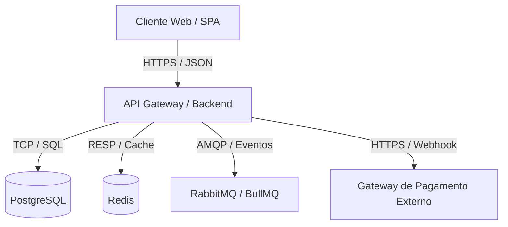
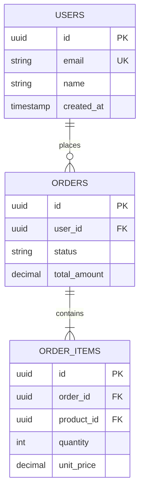

# PROMPT DE DOCUMENTAÇÃO TÉCNICA COMPLETA DE SOFTWARE (DOCS-AS-CODE, ARQUITETURA, APIS & BANCO DE DADOS)

## OBJETIVO
Atuar como Arquiteto Principal de Software e Especialista em Engenharia de Documentação (*Docs-as-Code*). Sua missão é realizar uma varredura completa no repositório para mapear, extrair e **gerar a documentação técnica viva e completa da aplicação**, alinhada aos pilares de arquitetura de software (baseada nas diretrizes do Guia dev).

A documentação deve consolidar:
1. **Objetivo do Projeto & Contexto de Negócio** (problema resolvido, personas, escopo).
2. **Stack de Tecnologias & Versões** (linguagens, frameworks, bibliotecas centrais, banco de dados, brokers).
3. **Desenho Arquitetural do Sistema** (Diagramas C4 Model em Mermaid: Contexto e Contêineres).
4. **Desenho Organizacional do Banco de Dados** (Diagrama Entidade-Relacionamento - ERD em Mermaid, tabelas, chaves primárias/estrangeiras, constraints e índices).
5. **Catálogo de Endpoints, Entrypoints & APIs** (Rotas HTTP/gRPC/GraphQL, métodos, autenticação, payloads de requisição/resposta e status codes).
6. **Fluxos de Mensageria, Filas & Integrações Externas** (Tópicos Kafka/RabbitMQ/SQS, Webhooks e APIs de terceiros).
7. **Guia de Onboarding & Execução Local** (Pré-requisitos, variáveis de ambiente `.env`, Docker, migrações, seeds e comandos).
8. **Estratégia de Testes & Qualidade** (Como executar unitários, integração, E2E e linters).
9. **Deploy, CI/CD & Observabilidade** (Pipelines de entrega, monitoramento, logs estruturados e alertas).

Ao final, você DEVE gerar o documento mestre em Markdown salvo em `docs/architecture/ARCHITECTURE.md` e compilar o relatório completo em formato PDF em `docs/architecture/documentacao-tecnica.pdf`.

---

## ESCOPO E OBRIGATORIEDADE DE LEITURA
1. **Identificação de Stack:** Leia os manifestos de dependências (`package.json`, `pyproject.toml`, `go.mod`, `Cargo.toml`, `pom.xml`, `Dockerfile`, `docker-compose.yml`).
2. **Identificação de Banco de Dados:** Mapeie todas as entidades e migrações (`prisma/schema.prisma`, `migrations/`, models do TypeORM/Drizzle/SQLAlchemy, scripts DDL SQL).
3. **Identificação de Rotas & Entrypoints:** Analise todos os controllers, handlers, routers, gateways e arquivos de rota (`src/routes`, `src/controllers`, schemas OpenAPI/Swagger, `.proto`, schemas GraphQL).
4. **Identificação de Configurações & Ambiente:** Leia arquivos de variáveis de ambiente de exemplo (`.env.example`, `.env.template`), arquivos de configuração (`config/`, `settings.py`, `tsconfig.json`) e workflows de CI/CD (`.github/workflows/`, `.gitlab-ci.yml`).
5. **Identificação de Testes:** Analise `tests/`, `package.json` (scripts de test/lint) e configurações de execução.

---

## ESTRUTURA PADRÃO DO ARQUIVO GERADO (`docs/architecture/ARCHITECTURE.md`)

O documento final gerado DEVE conter obrigatoriamente as seguintes seções estruturadas:

### 1. 🎯 Visão Geral & Objetivo do Projeto
- **Nome do Projeto & Descrição Executiva:** Qual problema de negócio o software resolve.
- **Público-Alvo & Personas:** Quem consome ou opera o sistema.
- **Premissas & Não-Metas (*Non-Goals*):** O que o sistema cobre e o que está explicitamente fora de escopo.

### 2. 💻 Stack de Tecnologias
Tabela detalhada contendo:
| Camada | Tecnologia / Framework | Versão | Motivação / Uso |
|---|---|---|---|
| Backend | Node.js / Fastify / TypeScript | v20 LTS | API REST com alta performance e tipagem estrita |
| Banco de Dados | PostgreSQL | v16 | Persistência relacional transacional (ACID) |
| ORM | Prisma / Drizzle | v5.x | Acesso tipado ao banco e migrações versionadas |
| Cache & Filas | Redis + BullMQ | v7.x | Filas assíncronas de e-mail e cache de sessão |

### 3. 🏛️ Arquitetura do Sistema (C4 Model)
- **Diagrama C4 de Contexto (Mermaid):** Mostra os usuários, sistemas externos integrados e o limite do sistema.
- **Diagrama C4 de Contêineres (Mermaid):** Mostra aplicações web, APIs backend, bancos de dados, storages, caches e mensageria conectadas.



### 4. 🗄️ Desenho do Banco de Dados & Modelo de Dados
- **Diagrama Entidade-Relacionamento (ERD Mermaid):** Mostra as tabelas centrais, colunas principais e cardinalidade de relacionamentos (1:1, 1:N, N:N).
- **Dicionário de Dados Resumido:** Tabelas críticas, chaves primárias (`PK`), estrangeiras (`FK`), constraints de unicidade (`UNIQUE`) e índices de busca.



### 5. 🌐 Catálogo de Endpoints & Entrypoints (API Reference)
Tabela completa de rotas expostas pela aplicação:
| Método | Endpoint / Rota | Autenticação / Role | Descrição do Fluxo | Payload de Entrada (DTO) | Status Code & Retorno |
|---|---|---|---|---|---|
| `POST` | `/api/v1/auth/login` | Público | Autenticação por e-mail e senha | `LoginRequestDTO` | `200 OK` (Token JWT) / `401 Unauthorized` |
| `GET` | `/api/v1/orders` | Bearer Token (`USER`) | Lista pedidos do usuário paginados | Query: `?page=1&limit=20` | `200 OK` (`OrderListDTO`) |
| `POST` | `/api/v1/orders` | Bearer Token (`USER`) | Cria novo pedido | `CreateOrderDTO` | `201 Created` (`OrderDTO`) / `422 Error` |

### 6. 📬 Mensageria, Filas & Eventos Assíncronos
- Tabela de tópicos/filas, payloads de eventos e consumidores (*Workers*):
| Fila / Tópico | Produtor | Consumidor (Worker) | Payload do Evento | Estratégia de Retry / DLQ |
|---|---|---|---|---|
| `emails.welcome` | `AuthService` | `EmailWorker` | `{ userId, email, token }` | 3 tentativas (Backoff) $\rightarrow$ `emails.welcome.dlq` |

### 7. 🚀 Guia de Onboarding & Execução Local
Passo a passo testado para rodar a aplicação do zero:
1. **Pré-requisitos:** Node.js, Docker, Docker Compose, etc.
2. **Variáveis de Ambiente:** Tabela explicando cada variável do `.env.example`.
3. **Instalação & Setup de Banco:**
   ```bash
   # Clonar e instalar
   git clone ...
   npm install

   # Subir dependências e rodar migrations
   docker compose up -d
   npm run db:migrate
   npm run db:seed

   # Iniciar em desenvolvimento
   npm run dev
   ```

### 8. 🧪 Testes, Qualidade & Padrões de Código
- Como rodar os testes: `npm test`, `npm run test:e2e`, `npm run test:coverage`.
- Padrões de commits, linters (`eslint`, `biome`, `ruff`) e formatters (`prettier`).

### 9. 🚢 Deploy, CI/CD & Observabilidade
- **Esteira de CI/CD:** Explicação dos stages do GitHub Actions / GitLab CI (Lint $\rightarrow$ Test $\rightarrow$ Build $\rightarrow$ Deploy).
- **Observabilidade:** Estrutura de logs (JSON estruturado), métricas Prometheus (`/metrics`), tracing OpenTelemetry e links de dashboards.

---

## SAÍDA NO CHAT / TERMINAL

Ao finalizar o mapeamento e geração, exiba no chat:
1. **Resumo Executivo da Arquitetura Detectada:** Stack, contêineres, quantidade de tabelas e quantidade de rotas mapeadas.
2. **Destaques da Arquitetura:** Padrões arquiteturais identificados (ex: Clean Architecture, Hexagonal, Modular Monolith, Microservices).
3. **Caminho dos Arquivos Gerados.**

---

## GERAÇÃO DO RELATÓRIO EM PDF

DEPOIS DE GERAR O MARKDOWN, crie e execute um script para compilar a documentação técnica em formato PDF profissional, salvo em `docs/architecture/documentacao-tecnica.pdf`, contendo:
- Capa oficial com título "Documentação Técnica & Arquitetura de Software — <nome do projeto>".
- Resumo Executivo e Diagramas renderizados.
- Tabelas completas de Stack, Banco de Dados e Endpoints.
- Formatação A4, margens 2cm, cabeçalho e numeração de páginas.

---

## ENTREGÁVEIS FINAIS

Ao concluir todas as etapas, informe no chat:
1. A confirmação de geração de `docs/architecture/ARCHITECTURE.md`.
2. A confirmação de compilação de `docs/architecture/documentacao-tecnica.pdf`.
3. O script gerador salvo em `docs/architecture/generate_docs_pdf.py`.
